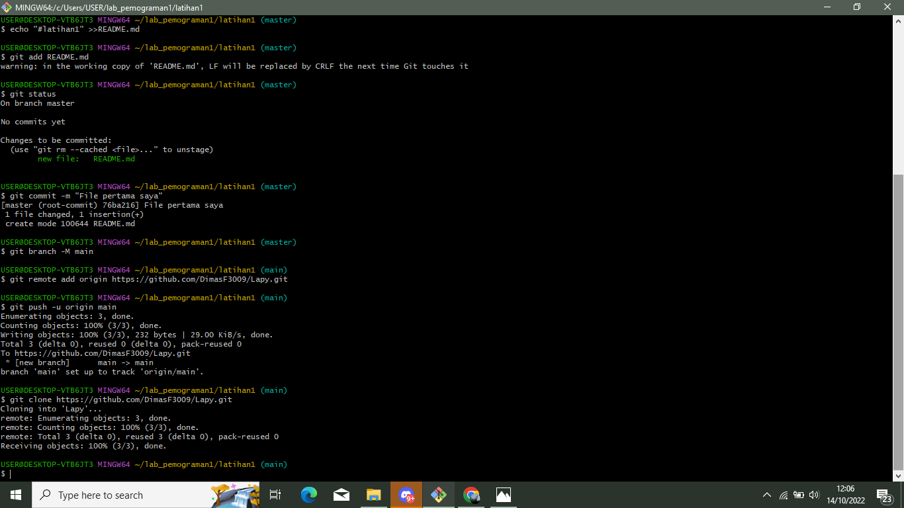

# Cara Penggunaan GIT
## Instalasi GIT
#### - Download Git, buka website resminya Git (git-scm.com).
#### - Kemudian unduh Git sesuai dengan arsitektur komputer kita. Kalau menggunakan 64bit, unduh yang 64bit. Begitu juga kalau menggunakan 32bit.
#### - Selamat, Git sudah terinstal di Windows. Untuk mencobanya, silahkan buka CMD atau PowerShell, kemudian ketik perintah 
```
git --Version
```

