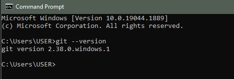
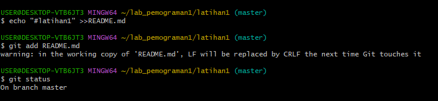
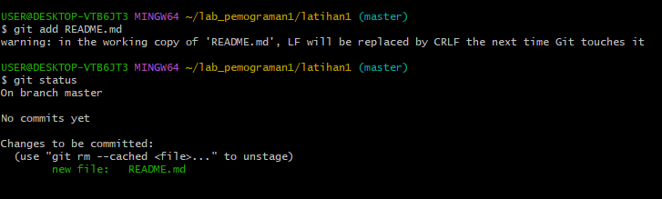
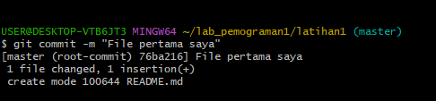
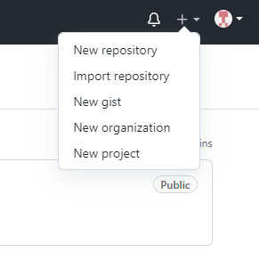
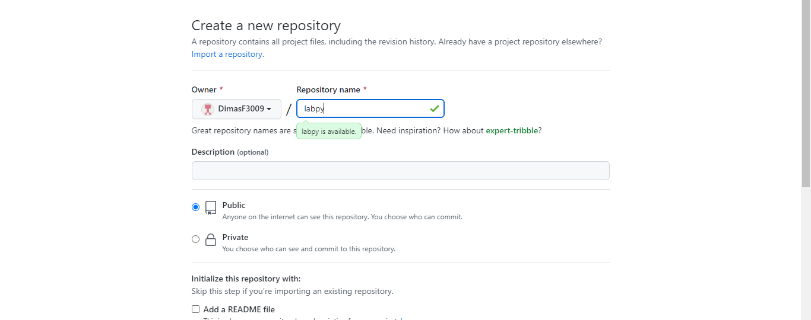

# Cara Penggunaan GIT
## Instalasi GIT
#### - Download Git, buka website resminya Git (git-scm.com).
#### - Kemudian unduh Git sesuai dengan arsitektur komputer kita. Kalau menggunakan 64bit, unduh yang 64bit. Begitu juga kalau menggunakan 32bit.
#### - Selamat, Git sudah terinstal di Windows. Untuk mencobanya, silahkan buka CMD atau PowerShell, kemudian ketik perintah 
```
git --Version
```


## Menambahkan Global Config
#### - Pada saat pertama kali menggunakan git, perlu dilakukan konfigurasi user.name dan user.email
#### - konfigurasi ini bisa dilakukan untuk global repostiry atau individual repository.
#### - Apabila belum dilakukan konfigurasi, akan mengakibatkan terjadi kegagalan saat menjalankan perintah git commit
#### - Config Global Repository
```
$ git config --global user.name "nama_user"
$ git config --global user.email "nama_user"
```

## Perintah Dasar Git
#### - "git init", perintah untuk membuat repository local
#### - "git add", perintah untuk menambahkan file baru, atau perubahan pada file pada staging sebelum proses commit.
#### - "git commit", perintah untuk menyimpan perubahan kedalam database git.
#### - "git push -u origin master", perintah untuk mengirim perubahan pada repository local menuju server repository.
#### - "git clone [url]", perintah untuk membuat working directory yang diambil dari repositry sever.
#### - "git remote add origin [url]", perintah untuk menambahkan remote server/reopsitory server pada local repositry (working directory).
#### - "git pull", perintah untuk mengambil/mendownload perubahan terbaru dari server repository ke local repository.

## Membuat Reposiory Local
#### - Buka direktory aktif, misal: d:\labs_pemrograman1 (buka menggunakan Windows Explorer)
#### - Klik kanan pada direktory aktif tersebut, dan pilih menu Git Bash, sehingga muncul git bash commad
#### - Buat direktory project praktikum pertama dengan nama latihan1
```
$ mkdir latihan1
$ cd latihan1
```
#### - Sehingga terbentuk satu direktori baru dibawahnya, selanjutnya masuk kedalam direktori tersebut dengan perintah cd (change directory).
#### - Direktory aktif menjadi: d:\labs_pemrograman1\latihan1

## Membuat Reposiory Local
#### - Jalankan perintah git init, untuk membuat repository local.
```
$ git init
```
#### - Repository baru berhasil di inisialisasi, dengan terbentuknya satu direktori hidden dengan nama .git
#### - Pada direktori tersebut, semua perubahan pada working directory akan disimpan.

## Menambahkan File baru pada repository
#### - Untuk membuat file dapat menggunakan text editor, lalu menyimpan filenya pada direktori aktif (repository)
#### - disini kita akan coba buat satu file bernama README.md (text file)
```
$ echo "#latihan1" >>README.md
```
#### - File README.md berhasil dibuat.


## Menambahkan File baru pada repository
#### - Untuk menambahkan file yang baru saja dibuat tersebut gunakan perintah git add.
```
$ git add README.md
```
#### - File README.md berhasil ditambahkan.


## Commit (Menyimpan perubahan ke database)
#### - Untuk menyimpan perubahan yang ada kedalam database repository local, gunakan perintah git commit -m “komentar commit”
```
$ git commit -m “File pertama saya”
```
#### - Perubahan berhasil disimpan.


## Membuat repository server
#### - Server reopsitory yang akan kita gunakan adalah http://github.com
#### - Anda harus membuat akun terlebih dahulu.
#### - Pada laman github, klik tombol start a project, atau
#### - Dari menu (icon +) klik New Repository


## Membuat repository server
#### - Isi nama repositorynya, misal: labpy.
#### - lalu klik tombol Create repository


## Menambahkan Remote Repository
#### - Remote Repository merupakan repository server yang akan digunakan untuk menyimpan setiap perubahan pada local repository, sehingga dapat diakses oleh banyak user.
#### - Untuk menambahkan remote repository server, gunakan perintah git remote add origin [url]
```
$ git remote add origin https://github.com/DimasF3009/lapy.git
```

## Push (Mengirim perubahan ke server)
#### - Untuk mengirim perubahan pada local repository ke server gunakan perintah git push.
```
$ git push -u origin master
```
#### - Perintah ini akan meminta memasukkan username dan password pada akun github.com
